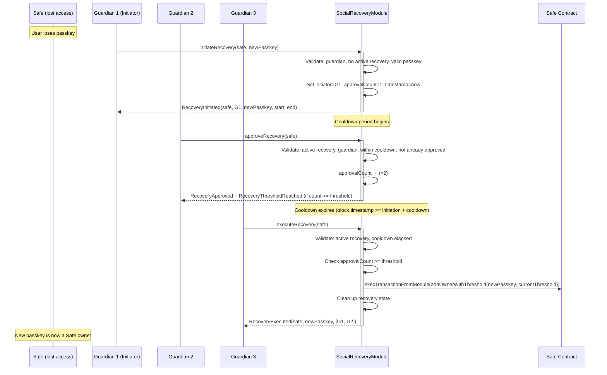
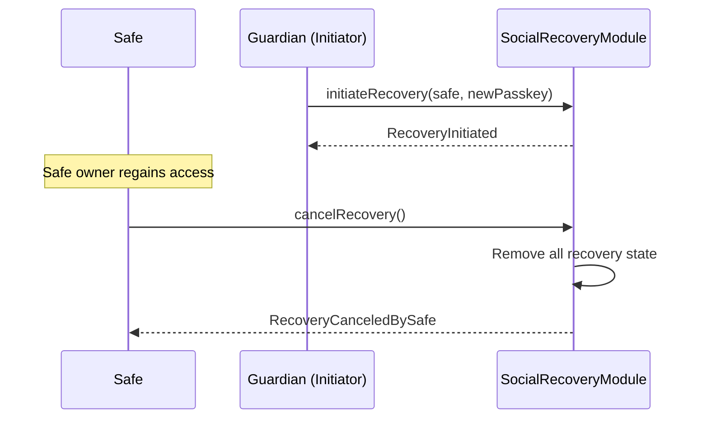
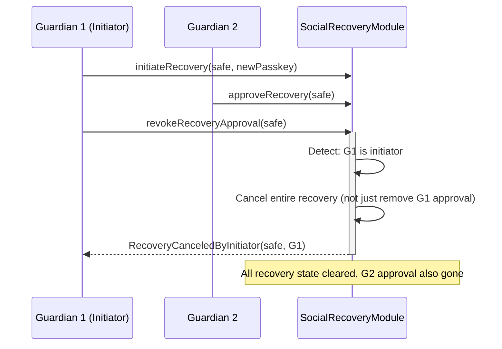
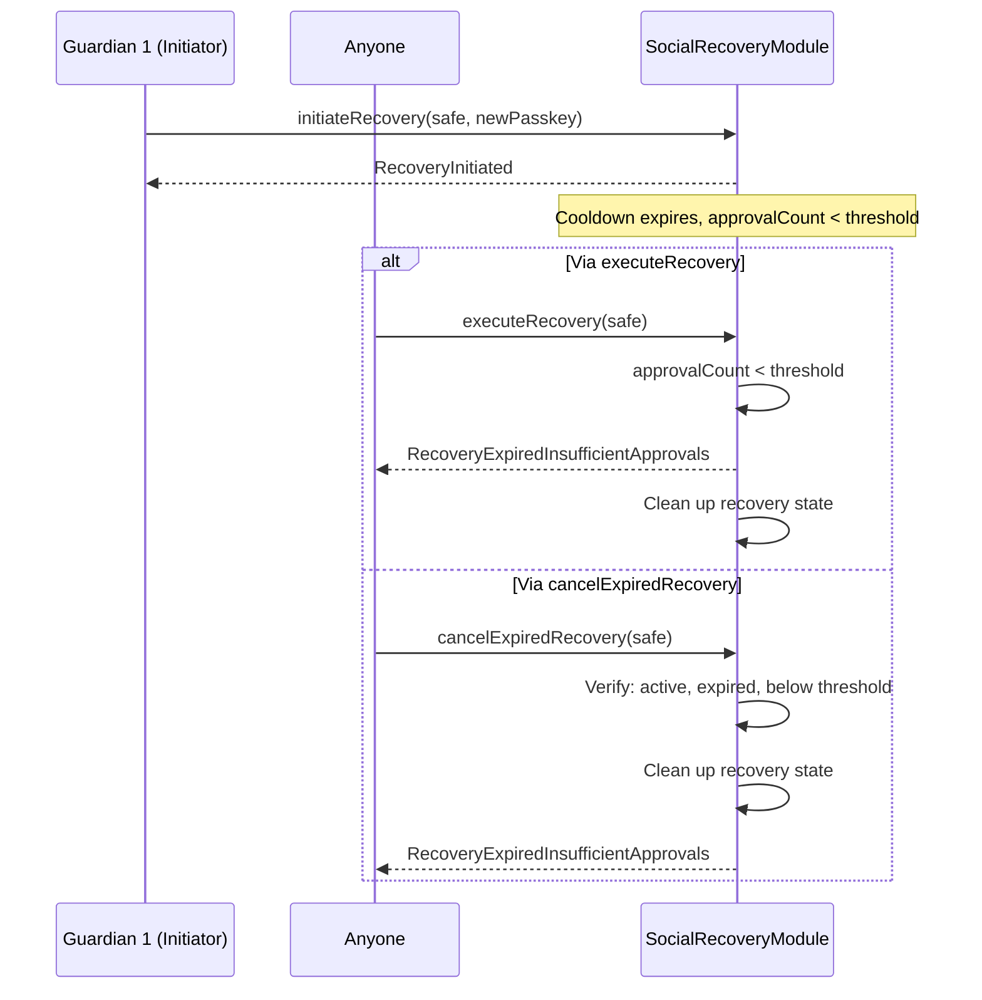
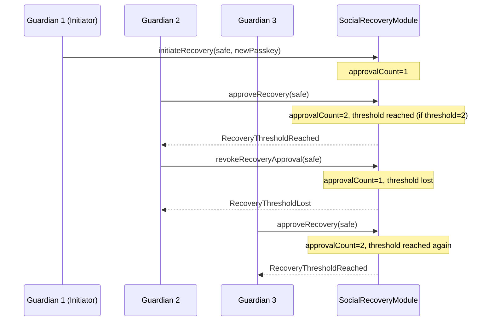
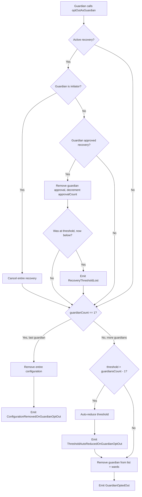

## Circles Social Recovery

## Usage

### Build

```shell
$ forge build
```

### Test

```shell
$ forge test
```

# SocialRecoveryModule Specification

## 1. Purpose

Enable Circles GApp users (Safe accounts) to recover access to their account when they lose their passkey. Trusted human guardians collectively approve adding a new WebAuthn passkey as a Safe owner.

## 2. Glossary

| Term         | Definition                                                                                                                                       |
| ------------ | ------------------------------------------------------------------------------------------------------------------------------------------------ |
| **Guardian** | A Circles-verified human who has mutual trust with the Safe in the Circles Hub. Can initiate/approve recovery.                                   |
| **Ward**     | A Safe that a guardian is responsible for guarding. Reverse of the guardian relationship.                                                        |
| **Cooldown** | Time window (in seconds) after recovery initiation during which guardians can approve/revoke. Execution is only possible after cooldown expires. |

## 3. Roles & Permissions

| Role                  | Can call                                                                                                                           |
| --------------------- | ---------------------------------------------------------------------------------------------------------------------------------- |
| **Safe (msg.sender)** | `configure`, `updateThreshold`, `updateRecoveryCooldown`, `addGuardian`, `removeGuardian`, `removeConfiguration`, `cancelRecovery` |
| **Guardian**          | `initiateRecovery`, `approveRecovery`, `revokeRecoveryApproval`, `optOutAsGuardian`                                                |
| **Anyone**            | `executeRecovery`, `cancelExpiredRecovery`, `getConfiguration`, `getRecovery`, `getWards`                                          |

## 4. Contract Dependencies

| Contract                     | Address                                      | Purpose                                                                        |
| ---------------------------- | -------------------------------------------- | ------------------------------------------------------------------------------ |
| Circles Hub v2               | `0xc12C1E50ABB450d6205Ea2C3Fa861b3B834d13e8` | `isHuman()` check, `isTrusted()` mutual trust verification                     |
| Safe WebAuthn Signer Factory | `0xF7488fFbe67327ac9f37D5F722d83Fc900852Fbf` | Validates passkey is a canonical signer proxy via `getSigner(x, y, verifiers)` |
| Safe (IModuleManager)        | per-Safe                                     | `isModuleEnabled()`, `execTransactionFromModule()` for adding new owner        |
| Safe (IOwnerManager)         | per-Safe                                     | `getThreshold()`, `addOwnerWithThreshold()`                                    |

## 5. Storage Layout

```
configurations[safe] => Config {
    threshold: uint256
    recoveryCooldown: uint256
    guardiansCount: uint256
    guardians: mapping(address => address)   // sentinel-linked list
}

recoveries[safe] => Recovery {
    initiator: address
    newPasskey: address
    initiationTimestamp: uint256
    approvalCount: uint256
    approvingGuardians: mapping(address => address)  // sentinel-linked list
}

wards[guardian] => mapping(address => address)  // sentinel-linked list of Safes guarded
```

## 6. Configuration Flow

### 6.1 Initial Configuration (`configure`)

**Preconditions:**

- `msg.sender` (Safe) must be human per `HUB.isHuman()`
- This module must be enabled on the Safe (`isModuleEnabled`)
- Safe must NOT already be configured (`threshold == 0`)
- `threshold >= 1` and `threshold <= guardians.length`
- `recoveryCooldown >= MINIMUM_COOLDOWN`
- Each guardian: must be human, must have mutual trust with Safe, cannot be the Safe itself, no duplicates

**Effects:**

- Sets threshold, cooldown, guardiansCount
- Builds guardian linked list + reverse ward index for each guardian

### 6.2 Reconfiguration (Safe-only)

All reconfiguration functions (`updateThreshold`, `updateRecoveryCooldown`, `addGuardian`, `removeGuardian`) **cancel any active recovery** before applying changes. This is by design: if the Safe can call these, it still has access and recovery is unnecessary.

| Function                    | Key constraints                                                  |
| --------------------------- | ---------------------------------------------------------------- |
| `updateThreshold(t)`        | `t <= guardiansCount`                                            |
| `updateRecoveryCooldown(c)` | `c >= MINIMUM_COOLDOWN`                                          |
| `addGuardian(g, t)`         | `t <= guardiansCount + 1`; guardian must be human + mutual trust |
| `removeGuardian(g, t)`      | `t <= guardiansCount - 1`; guardian must exist in list           |
| `removeConfiguration()`     | Removes config + all ward references                             |

## 7. Recovery Workflow

### 7.1 Happy Path



### 7.2 Recovery Canceled by Safe



### 7.3 Recovery Canceled by Initiator Revoking



### 7.4 Recovery Expired (Insufficient Approvals)



### 7.5 Approval / Revocation During Cooldown



## 8. Guardian Opt-Out Scenarios

`optOutAsGuardian(safe)` is called by a guardian to unilaterally leave. The effects depend on the current state:



## 12. Passkey Validation

The `_isValidPasskey` function verifies that the proposed `newPasskey` address is a legitimate Safe WebAuthn signer proxy:

1. Calls `ISafeWebAuthnSignerProxy(passkey).getConfiguration()` to get `(x, y, verifiers)`
2. Calls `SAFE_WEB_AUTHN_SIGNER_FACTORY.getSigner(x, y, verifiers)` to derive the expected address
3. Compares derived address with `passkey` — must match exactly
4. If `getConfiguration()` reverts (e.g., not a proxy), returns `false`

## 13. Execution: Module Transaction

On successful recovery (`approvalCount >= threshold` after cooldown):

1. Read current Safe owner threshold via `IOwnerManager(safe).getThreshold()`
2. Encode `addOwnerWithThreshold(newPasskey, currentThreshold)` call
3. Execute via `IModuleManager(safe).execTransactionFromModuleReturnData(safe, 0, callData, 0)`
4. If execution fails, bubble up the revert data

The new passkey becomes an **additional** owner. The Safe owner threshold remains unchanged.

## 15. Recovery Timeline

```mermaid
gantt
    title Recovery Timeline
    dateFormat X
    axisFormat %s

    section Phases
    Cooldown Period (approve/revoke allowed) :active, cooldown, 0, 604800
    Execution Window (execute allowed)       :exec, 604800, 1209600

    section Actions
    initiateRecovery (t=0)             :milestone, m1, 0, 0
    approveRecovery (during cooldown)  :milestone, m2, 300000, 300000
    revokeRecovery (during cooldown)   :milestone, m3, 400000, 400000
    Cooldown expires                   :milestone, m4, 604800, 604800
    executeRecovery (after cooldown)   :milestone, m5, 604801, 604801
```


